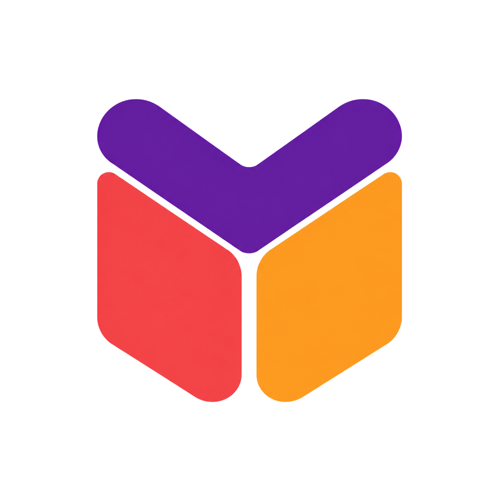
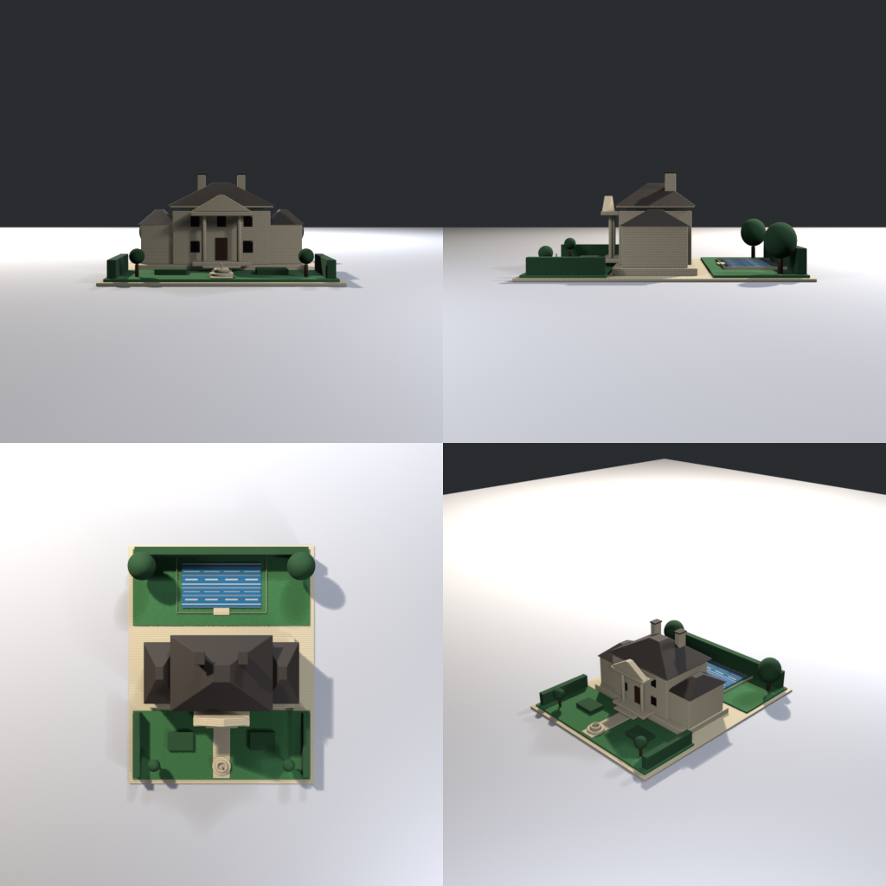

<h1 align="center">
  <br>
  Mason
</h1>

<p align="center">
  <a href="https://www.python.org/downloads/">
    
  </a>
  
  
  
</p>

---

<p align="center">
  <br>
  <sub><em>Grand Mansion — built with Mason + Grok 4.6 Fast (High Effort)</em></sub>
</p>

Mason is a local CLI. Coding agents write a YAML spec; Mason runs
[Blender](https://www.blender.org/), [Krita](https://krita.org/en/),
[Aseprite](https://www.aseprite.org/), or
[ImageMagick](https://imagemagick.org/) headlessly, validates the
output, and writes previews. It has no LLM and does not bundle those
apps. Specs are source. Editor files and previews are outputs.

Windows, macOS, and Linux. Python 3.12+.

## Install

Prefer [uv](https://docs.astral.sh/uv/). `uv tool install` puts
`mason` on PATH. Open a new terminal if the current one cannot see it.

### Use Mason in a game

Install the CLI once, then work in the game repo. The Mason repo is
private, so GitHub auth has to work for git (`gh auth login`, or a
credential helper) before this URL will clone.

```bash
uv tool install "git+https://github.com/Unveil-gg/mason.git"
mason doctor
```

`mason doctor` looks for Blender in machine config, then on PATH,
then in common install folders (`Program Files/Blender Foundation`,
`/Applications/Blender.app`, `/usr/bin/blender`). Set a path only
when doctor does not find it. The version folder on Windows is
whatever you installed:

```bash
mason config set tools.blender.path "C:/Program Files/Blender Foundation/Blender 4.2/blender.exe"
mason config set tools.blender.path "/Applications/Blender.app/Contents/MacOS/Blender"
```

Krita, Aseprite, and ImageMagick are optional. Doctor finds them
the same way (`krita` or `kritarunner`, `magick` then `convert`,
`aseprite`). After you install one later, run `mason tools scan`.

Machine config is `%APPDATA%/Mason/config.yaml` on Windows and
`~/.config/mason/config.yaml` on macOS and Linux. Keep those paths
out of asset specs.

In the game repo:

```bash
mason init
```

That writes `mason.yaml`, adds `.mason/` to an existing
`.gitignore`, and installs the Mason skill into
`.agents/skills/mason` (linked for Cursor and Claude, or copied
if the OS refuses the link). It does not edit `AGENTS.md`. Run
`mason init` again after a Mason upgrade to refresh the skill.
An existing `mason.yaml` and
any `styles/` files are left as they are. The `default` style is
built into the CLI; add `styles/<name>.yaml` only for a project look.

`mason init --global` installs the skill for your user and skips
project files.

### Agent skill ([skills.sh](https://skills.sh))

There is no separate publish step. The skill lives in this repo at
`skills/mason/`. Anyone with repo access installs it with the
[Vercel skills CLI](https://github.com/vercel-labs/skills):

```bash
npx skills add Unveil-gg/mason              # this project
npx skills add Unveil-gg/mason -g           # all projects (this user)
npx skills add Unveil-gg/mason -s mason -y  # non-interactive, mason only
npx skills add Unveil-gg/mason --list       # list skills in the repo
```

The skill installs the CLI if `mason` is missing, runs `mason init`
when there is no `mason.yaml`, then builds from the user's request.
`mason init` copies the same skill into the project and refreshes it
on upgrade.

Listing on [skills.sh](https://skills.sh) is driven by public installs
and indexing, not a form. A **public** GitHub repo helps discovery; a
private repo still works with `gh auth login` (or another credential
helper) but may not appear on skills.sh until the repo is public and
people install from it. After you go public, run one install yourself
to seed the directory.

### Develop Mason

```bash
git clone https://github.com/Unveil-gg/mason.git
cd mason
uv sync
uv run mason doctor
uv tool install --editable .
```

`--editable` keeps the PATH command on this clone after you pull.
`pip install -e ".[dev]"` is the same idea without uv.

| Tool | Used for |
| --- | --- |
| Blender 4+ | `static_prop` → `.blend` / `.glb` and previews |
| Krita | `layered_raster` → `.kra` + PNG |
| Aseprite | `sprite_sheet` → PNG + `frames.json` |
| ImageMagick | `image_process` (resize, quantize, …) |

## Quick start

From the game repo, save this as `crate.yaml`:

```yaml
type: static_prop
id: simple_crate
name: Simple Crate
dimensions: {width: 0.6, depth: 0.6, height: 0.6}
style: default
geometry:
  recipe: crate
  bevel: true
materials:
  primary: wood_dark
export:
  format: glb
  save_blend: true
```

```bash
mason build crate.yaml
mason inspect simple_crate --json
mason rebuild simple_crate
```

Recipes (`crate`, `shelf`, `table`, `hydrant`, `cart`, `house`,
`tree`, `pool`, `estate`) are shortcuts. New shapes are `parts`
plus a style. EEVEE is preferred; Mason falls back to Cycles CPU.

A part can use another job's PNG instead of a flat color. Build
the raster first. Boxes and cylinders tile by `textures.tile_size`.
A textured plane is a decal (one stretched image).

```yaml
geometry:
  parts:
    - name: crate
      size: [0.6, 0.6, 0.6]
      location: [0, 0, 0.3]
      texture:
        asset: plank_texture
        file: output/asset.png
```

Edit `styles/<name>.yaml` for palette, family roughness, bevel,
and tile size. Specs name the style. They do not inline hex.

`variants` on a `static_prop` builds sibling jobs (`<id>_<suffix>`)
from one spec. `palette_overrides` patches that job only.

```bash
mason preview <id> --demo-lighting   # one warmer screenshot
```

That flag does not change the spec or later builds.

Raster layers are fills, shapes, text, stamps, and `pixels` +
`keys`. A sprite sheet is the same pixels, one map per frame, on
the style palette. `mason ingest <image> --asset <id>` measures a
reference and, for a new id, writes `assets/<id>.yaml`. It does
not build a mesh. You still write `parts` or `layers`.

## Commands

| Command | Purpose |
| --- | --- |
| `mason doctor` | Detect tools and capabilities |
| `mason init` | Project pin plus the Mason skill |
| `mason init --global` | User skill only |
| `mason workflow` | Directed build loop |
| `mason build <spec.yaml>` | Generate, run the tool, preview, validate |
| `mason rebuild <asset-id>` | Rebuild from the stored job |
| `mason preview <asset-id>` | Re-render previews only |
| `mason inspect <asset-id>` | Job state, previews, metrics |
| `mason stats [id]` | Triangle / mesh / material counts |
| `mason validate <asset-id>` | Re-read stored validation |
| `mason evaluate <id> <json>` | Store a critic evaluation |
| `mason decompose <id> <graph>` | Store an assembly graph |
| `mason assemble <id>` | Instance accepted component GLBs |
| `mason history <asset-id>` | Iteration snapshots |
| `mason style [name]` | Palette, families, quality |
| `mason export <asset-id>` | Copy finished outputs |
| `mason export --kit <id>` | Export an already-built kit |
| `mason vocab` | Shapes, components, recipes, stamps |
| `mason ingest <image>` | Measure concept art. `--component` scopes an isolate |
| `mason compare <id>` | Write `previews/compare.png` |
| `mason clean [id]` | Delete stored jobs |
| `mason list` | Jobs in this project |
| `mason tools scan` | Rediscover tool paths |
| `mason config get/set` | Machine config |

`--json` prints JSON on stdout. Diagnostics go to stderr.

```json
{"success": false, "error": {"code": "blender_missing", "message": "..."}}
```

## Export

Builds stay in `.mason/jobs/<id>/`. Export copies the finished
`.glb` or `.png` (and a sprite's `frames.json`) into another project.
It skips `.blend`, `.kra`, and previews.

```bash
mason export simple_crate --to ../my_game/res
mason export simple_crate --layout grouped
```

`--to` wins over `export.install_to` on the spec, which wins over
`install_dir` in `mason.yaml`. Each export updates
`mason_manifest.json` at the destination. Mason does not write
Godot `.import` files. For pixel art, set the Godot project’s
default texture filter to Nearest.

A kit is a list of jobs you have already built. Export does not
build them or merge them into one GLB.

```yaml
# kits/cafe.yaml
id: cafe
name: Cafe furniture
members: [simple_crate, simple_shelf]
```

```bash
mason export --kit cafe --to ../my_game/res/models --engine godot
```

## Layout

```
mason.yaml
.agents/skills/mason/   # skill, refreshed by mason init
styles/<name>.yaml      # optional project look
.mason/jobs/<asset-id>/
  asset.yaml
  build.py
  output/          # .blend .glb .kra .png
  previews/        # three_quarter, or full.png for rasters
  validation.json
```

The skill tells the agent to `doctor --json`, edit the spec,
`build --json`, then open the primary preview. A clean exit is
not “it looks right.” `default` needs no style file.

## Limits (v0.1)

- Rasters are fills, shapes, text, stamps, and pixel maps.
- Ingest measures a reference. It does not compile a mesh.
- Export copies files and a manifest. It does not build Godot scenes.
- Kits do not build their members.
- No bundled creative apps.

Design notes: [docs/roadmap.md](docs/roadmap.md).
