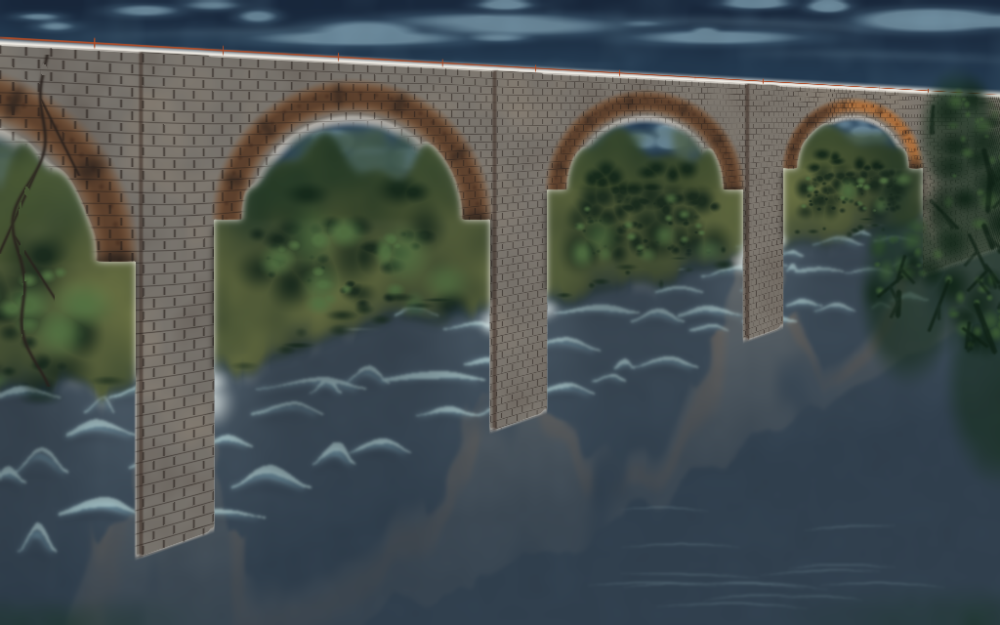

<h1 align="center">
  <br>
  Mason<br>
  <sub>Local asset-generation harness for coding agents.</sub>
</h1>

<p align="center">
  <a href="https://www.python.org/downloads/">
    
  </a>
  
  
  
</p>

---

<p align="center">
  <br>
  <sub><em>3D — Grand Mansion, Mason + Grok 4.6 Fast (High Effort)</em></sub>
</p>

<p align="center">
  <br>
  <sub><em>2D — Bridge over Troubled Water, agent-painted raster job; Grok 4.7 High Fast</em></sub>
</p>

Mason is a local CLI. Coding agents write a YAML spec; Mason runs
[Blender](https://www.blender.org/), [Krita](https://krita.org/en/),
[Aseprite](https://www.aseprite.org/), or
[ImageMagick](https://imagemagick.org/) headlessly, validates the
output, and writes previews. It has no LLM and does not bundle those
apps. Specs are source. Editor files and previews are outputs.

Windows, macOS, and Linux. Python 3.12+.

## Install

Prefer [uv](https://docs.astral.sh/uv/). Install once, then init in
the game repo (public clone needs no extra GitHub login; private
repos need `gh auth login` or similar).

```bash
uv tool install "git+https://github.com/Unveil-gg/mason.git"
mason doctor
mason init
```

Paths, optional tools, `mason init --global`, skills.sh, and
developing this repo: [docs/install.md](docs/install.md).

## Quick start

From the game repo, save this as `crate.yaml`:

```yaml
type: static_prop
id: simple_crate
name: Simple Crate
dimensions: {width: 0.6, depth: 0.6, height: 0.6}
style: default
geometry:
  recipe: crate
  bevel: true
materials:
  primary: wood_dark
export:
  format: glb
  save_blend: true
```

```bash
mason build crate.yaml
mason inspect simple_crate --json
mason rebuild simple_crate
```

Outputs land under `.mason/jobs/<id>/`. Recipes, textures, styles,
variants, rasters, and ingest: [docs/spec-guide.md](docs/spec-guide.md).

## Layout

```
mason.yaml
.agents/skills/mason/   # skill, refreshed by mason init
styles/<name>.yaml      # optional project look
.mason/jobs/<asset-id>/
  asset.yaml
  build.py
  output/          # .blend .glb .kra .png
  previews/        # three_quarter, or full.png for rasters
  validation.json
```

The skill tells the agent to `doctor --json`, edit the spec,
`build --json`, then open the primary preview. A clean exit is
not “it looks right.” `default` needs no style file.

## Export

Copy finished `.glb` or `.png` (and sprite `frames.json`) into your
game project; job folders keep sources and previews.

```bash
mason export simple_crate --to ../my_game/res
mason export simple_crate --layout grouped --engine godot --optimize
```

Precedence, kits, manifest, and engine notes:
[docs/export.md](docs/export.md).

<details>
<summary><strong>All commands</strong></summary>

Common: `build`, `rebuild`, `inspect`, `preview`, `export`, `doctor`,
`init`, `workflow`.

| Command | Purpose |
| --- | --- |
| `mason doctor` | Detect tools and capabilities |
| `mason init` | Project pin plus the Mason skill |
| `mason init --global` | User skill only |
| `mason workflow` | Directed build loop |
| `mason build <spec.yaml>` | Generate, run the tool, preview, validate |
| `mason rebuild <asset-id>` | Rebuild from the stored job |
| `mason preview <asset-id>` | Re-render previews only |
| `mason inspect <asset-id>` | Job state, previews, metrics |
| `mason stats [id]` | Triangle / mesh / material counts |
| `mason validate <asset-id>` | Re-read stored validation |
| `mason evaluate <id> <json>` | Store a critic evaluation |
| `mason decompose <id> <graph>` | Store an assembly graph |
| `mason assemble <id>` | Instance accepted component GLBs |
| `mason history <asset-id>` | Iteration snapshots |
| `mason style [name]` | Palette, families, quality |
| `mason export <asset-id>` | Copy finished outputs (`--optimize`, `--engine`) |
| `mason export --kit <id>` | Export an already-built kit |
| `mason vocab` | Shapes, components, recipes, stamps |
| `mason ingest <image>` | Measure concept art. `--component` scopes an isolate |
| `mason compare <id>` | Write `previews/compare.png` |
| `mason clean [id]` | Delete stored jobs |
| `mason list` | Jobs in this project |
| `mason tools scan` | Rediscover tool paths |
| `mason config get/set` | Machine config |

`--json` prints JSON on stdout. Diagnostics go to stderr.

```json
{"success": false, "error": {"code": "blender_missing", "message": "..."}}
```

</details>

## Documentation

- [Install and setup](docs/install.md)
- [Spec guide](docs/spec-guide.md)
- [Export](docs/export.md)
- [Roadmap](docs/roadmap.md)

## Limits (v0.1)

- Rasters are fills, shapes, text, stamps, and pixel maps.
- Ingest measures a reference. It does not compile a mesh.
- Export copies files and a manifest. It does not build engine scenes.
- Kits do not build their members.
- No bundled creative apps.
